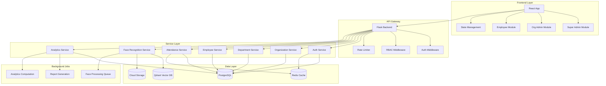
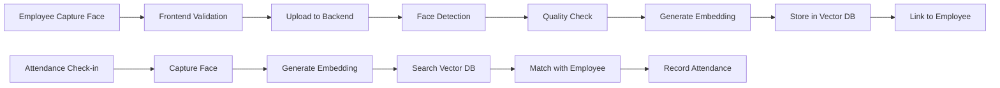

# Multi-Tenant Attendance Tracking System - Architecture Document

## Overview
Enterprise-grade, AI-powered attendance tracking system with multi-organization support, role-based access control, and face recognition capabilities.

## System Architecture



## Database Schema Design

### Core Tables

#### 1. Organizations
```sql
organizations
  - id (PK, UUID)
  - name (string, unique, indexed)
  - code (string, unique, indexed)
  - address (text)
  - contact_email (string)
  - contact_phone (string)
  - subscription_tier (enum: free, basic, premium, enterprise)
  - settings (jsonb) -- organization-specific settings
  - is_active (boolean, default: true)
  - created_at (timestamp)
  - updated_at (timestamp)
  - deleted_at (timestamp, nullable) -- soft delete
```

#### 2. Departments
```sql
departments
  - id (PK, UUID)
  - organization_id (FK -> organizations.id, indexed)
  - name (string)
  - code (string)
  - description (text)
  - manager_id (FK -> employees.id, nullable)
  - is_active (boolean, default: true)
  - created_at (timestamp)
  - updated_at (timestamp)
  - deleted_at (timestamp, nullable)
  - UNIQUE(organization_id, code)
```

#### 3. Roles
```sql
roles
  - id (PK, UUID)
  - name (string, unique) -- super_admin, org_admin, employee
  - description (text)
  - permissions (jsonb) -- { "users": ["create", "read", "update", "delete"], ... }
  - created_at (timestamp)
  - updated_at (timestamp)
```

#### 4. Users (Unified Auth Table)
```sql
users
  - id (PK, UUID)
  - email (string, unique, indexed)
  - username (string, unique, indexed)
  - password_hash (string)
  - role_id (FK -> roles.id, indexed)
  - organization_id (FK -> organizations.id, nullable, indexed)
  - is_active (boolean, default: true)
  - last_login (timestamp, nullable)
  - created_at (timestamp)
  - updated_at (timestamp)
  - deleted_at (timestamp, nullable)
```

#### 5. Employees
```sql
employees
  - id (PK, UUID)
  - user_id (FK -> users.id, unique, indexed)
  - organization_id (FK -> organizations.id, indexed)
  - department_id (FK -> departments.id, indexed)
  - employee_code (string)
  - full_name (string, indexed)
  - gender (enum: male, female, other)
  - date_of_birth (date)
  - phone_number (string)
  - emergency_contact (jsonb)
  - address (text)
  - joining_date (date)
  - designation (string)
  - employment_type (enum: full_time, part_time, contract, intern)
  - shift_id (FK -> shifts.id, nullable)
  - is_active (boolean, default: true)
  - created_at (timestamp)
  - updated_at (timestamp)
  - deleted_at (timestamp, nullable)
  - UNIQUE(organization_id, employee_code)
```

#### 6. Face Embeddings
```sql
face_embeddings
  - id (PK, UUID)
  - employee_id (FK -> employees.id, indexed)
  - organization_id (FK -> organizations.id, indexed)
  - embedding_vector (jsonb or vector type) -- 128/512 dimensional
  - model_version (string) -- track which model generated this
  - quality_score (float) -- face image quality
  - image_url (string) -- reference to cloud storage
  - is_primary (boolean, default: false)
  - created_at (timestamp)
  - updated_at (timestamp)
  - deleted_at (timestamp, nullable)
```

#### 7. Attendance Records
```sql
attendance_records
  - id (PK, UUID)
  - employee_id (FK -> employees.id, indexed)
  - organization_id (FK -> organizations.id, indexed)
  - date (date, indexed)
  - check_in_time (timestamp, nullable)
  - check_out_time (timestamp, nullable)
  - status (enum: present, absent, half_day, on_leave, holiday)
  - work_hours (float, computed)
  - location_check_in (point) -- GPS coordinates
  - location_check_out (point)
  - device_info (jsonb) -- device used for attendance
  - face_match_confidence (float, nullable) -- AI confidence score
  - notes (text)
  - approved_by (FK -> users.id, nullable)
  - created_at (timestamp)
  - updated_at (timestamp)
  - UNIQUE(employee_id, date)
  - INDEX(organization_id, date)
  - INDEX(employee_id, date)
```

#### 8. Shifts
```sql
shifts
  - id (PK, UUID)
  - organization_id (FK -> organizations.id, indexed)
  - name (string)
  - start_time (time)
  - end_time (time)
  - grace_period_minutes (integer, default: 15)
  - working_days (array of integers) -- [1,2,3,4,5] for Mon-Fri
  - is_active (boolean, default: true)
  - created_at (timestamp)
  - updated_at (timestamp)
```

#### 9. Leave Requests
```sql
leave_requests
  - id (PK, UUID)
  - employee_id (FK -> employees.id, indexed)
  - organization_id (FK -> organizations.id, indexed)
  - leave_type (enum: sick, casual, earned, unpaid)
  - start_date (date)
  - end_date (date)
  - total_days (float)
  - reason (text)
  - status (enum: pending, approved, rejected)
  - approved_by (FK -> users.id, nullable)
  - approval_notes (text)
  - created_at (timestamp)
  - updated_at (timestamp)
```

#### 10. Audit Logs
```sql
audit_logs
  - id (PK, UUID)
  - user_id (FK -> users.id, indexed)
  - organization_id (FK -> organizations.id, indexed)
  - action (string, indexed) -- create, update, delete, login, etc.
  - entity_type (string) -- table name
  - entity_id (UUID) -- record id
  - old_values (jsonb)
  - new_values (jsonb)
  - ip_address (inet)
  - user_agent (text)
  - created_at (timestamp, indexed)
```

## Backend Service Architecture

### Service Structure
```
vms_backend/
├── app/
│   ├── __init__.py                 # App factory
│   ├── config.py                   # Configuration management
│   ├── extensions.py               # Flask extensions
│   ├── middleware/
│   │   ├── __init__.py
│   │   ├── auth.py                 # JWT authentication
│   │   ├── rbac.py                 # Role-based access control
│   │   ├── tenant.py               # Multi-tenant isolation
│   │   └── rate_limit.py           # API rate limiting
│   ├── models/
│   │   ├── __init__.py
│   │   ├── organization.py
│   │   ├── department.py
│   │   ├── user.py
│   │   ├── employee.py
│   │   ├── role.py
│   │   ├── attendance.py
│   │   ├── face_embedding.py
│   │   ├── shift.py
│   │   ├── leave_request.py
│   │   └── audit_log.py
│   ├── services/
│   │   ├── __init__.py
│   │   ├── auth_service.py
│   │   ├── organization_service.py
│   │   ├── department_service.py
│   │   ├── employee_service.py
│   │   ├── attendance_service.py
│   │   ├── face_recognition_service.py
│   │   ├── analytics_service.py
│   │   └── notification_service.py
│   ├── api/
│   │   ├── __init__.py
│   │   ├── auth/
│   │   ├── organizations/
│   │   ├── departments/
│   │   ├── employees/
│   │   ├── attendance/
│   │   ├── analytics/
│   │   └── admin/
│   ├── utils/
│   │   ├── __init__.py
│   │   ├── validators.py
│   │   ├── decorators.py
│   │   ├── responses.py
│   │   └── exceptions.py
│   └── tasks/
│       ├── __init__.py
│       ├── face_processing.py
│       └── report_generation.py
├── migrations/
├── tests/
├── requirements.txt
└── wsgi.py
```

## Frontend Architecture

### Module Structure
```
vms_frontend/
├── src/
│   ├── App.js
│   ├── index.js
│   ├── contexts/
│   │   ├── AuthContext.js
│   │   ├── OrganizationContext.js
│   │   └── ThemeContext.js
│   ├── hooks/
│   │   ├── useAuth.js
│   │   ├── useOrganization.js
│   │   └── useRBAC.js
│   ├── modules/
│   │   ├── super-admin/
│   │   │   ├── pages/
│   │   │   ├── components/
│   │   │   └── hooks/
│   │   ├── org-admin/
│   │   │   ├── pages/
│   │   │   ├── components/
│   │   │   └── hooks/
│   │   └── employee/
│   │       ├── pages/
│   │       ├── components/
│   │       └── hooks/
│   ├── shared/
│   │   ├── components/
│   │   ├── layouts/
│   │   └── utils/
│   ├── services/
│   │   ├── api/
│   │   │   ├── auth.api.js
│   │   │   ├── organization.api.js
│   │   │   ├── employee.api.js
│   │   │   ├── attendance.api.js
│   │   │   └── analytics.api.js
│   │   └── config.js
│   ├── routes/
│   │   ├── PrivateRoute.jsx
│   │   ├── RoleBasedRoute.jsx
│   │   └── AppRoutes.jsx
│   └── styles/
├── public/
└── package.json
```

## Security Architecture

### 1. Authentication Flow
```
1. User Login → Backend validates credentials
2. Backend generates JWT with user info + organization context
3. JWT returned to frontend (stored in httpOnly cookie + localStorage backup)
4. Frontend includes JWT in Authorization header for all requests
5. Backend validates JWT on each request
6. JWT refresh mechanism for long sessions
```

### 2. Authorization (RBAC)
```
Permissions Matrix:
- super_admin: Full system access, manage all organizations
- org_admin: Manage own organization (departments, employees, attendance)
- employee: View own data, mark attendance
```

### 3. Multi-Tenant Isolation
```
- Every query filtered by organization_id
- Middleware automatically injects organization context
- Row-level security policies (database level)
```

## AI/Face Recognition Architecture

### Face Recognition Flow


### Embedding Strategy
- **Model**: DeepFace (ArcFace, FaceNet, or VGG-Face)
- **Vector Size**: 512 dimensions
- **Storage**: Qdrant vector database for fast similarity search
- **Matching Threshold**: 0.6-0.7 cosine similarity
- **Quality Checks**: Face detection confidence, blur detection, lighting validation

## Performance Optimization

### 1. Caching Strategy
```
Redis Cache:
- User sessions (TTL: 24 hours)
- Organization settings (TTL: 1 hour)
- Employee basic info (TTL: 30 minutes)
- Daily attendance stats (TTL: 5 minutes)
```

### 2. Database Optimization
```
Indexes:
- organization_id on all major tables
- date + employee_id on attendance_records
- Composite index on (organization_id, created_at) for audit_logs
- Full-text search index on employee names
```

### 3. Background Jobs
```
Celery/RQ Tasks:
- Face embedding generation (async)
- Daily attendance reports
- Analytics computation
- Email notifications
```

## API Structure

### RESTful Endpoints

#### Authentication
```
POST   /api/auth/login
POST   /api/auth/logout
POST   /api/auth/refresh
POST   /api/auth/forgot-password
POST   /api/auth/reset-password
```

#### Organizations (Super Admin)
```
GET    /api/organizations
POST   /api/organizations
GET    /api/organizations/:id
PUT    /api/organizations/:id
DELETE /api/organizations/:id
```

#### Departments (Org Admin)
```
GET    /api/departments
POST   /api/departments
GET    /api/departments/:id
PUT    /api/departments/:id
DELETE /api/departments/:id
```

#### Employees (Org Admin)
```
GET    /api/employees
POST   /api/employees
GET    /api/employees/:id
PUT    /api/employees/:id
DELETE /api/employees/:id
POST   /api/employees/:id/face-register
GET    /api/employees/:id/attendance-history
```

#### Attendance
```
GET    /api/attendance
POST   /api/attendance/check-in
POST   /api/attendance/check-out
GET    /api/attendance/my-history
GET    /api/attendance/report
```

#### Analytics
```
GET    /api/analytics/dashboard
GET    /api/analytics/attendance-summary
GET    /api/analytics/employee-stats
GET    /api/analytics/department-stats
```

## Migration Strategy

### Phase 1: Backend Foundation
1. Create new models with multi-tenant support
2. Implement JWT authentication
3. Build RBAC middleware
4. Setup organization isolation

### Phase 2: Core Services
1. Organization management
2. Department management
3. Employee management
4. Role management

### Phase 3: Attendance & AI
1. Face recognition service refactor
2. Attendance marking system
3. Attendance reporting

### Phase 4: Frontend Restructure
1. State management setup
2. Role-based routing
3. Module separation
4. Dashboard implementations

### Phase 5: Advanced Features
1. Analytics & reporting
2. Leave management
3. Shift management
4. Notifications

## Deployment Architecture

### Environment Setup
```
Development:
- Local PostgreSQL
- Local Redis
- Local Qdrant
- React dev server
- Flask debug mode

Staging:
- Cloud PostgreSQL (managed)
- Cloud Redis (managed)
- Cloud Qdrant (managed)
- S3/Cloud Storage for images
- Containerized services

Production:
- High-availability PostgreSQL cluster
- Redis cluster
- Qdrant cluster
- CDN for static assets
- Load-balanced application servers
- Auto-scaling enabled
```

## Technology Stack

### Backend
- **Framework**: Flask 3.x
- **Database**: PostgreSQL 15+
- **Cache**: Redis 7+
- **Vector DB**: Qdrant
- **Auth**: JWT (PyJWT)
- **Face Recognition**: DeepFace + OpenCV
- **Task Queue**: Celery + Redis (optional)

### Frontend
- **Framework**: React 18+
- **State Management**: Context API + useReducer
- **Routing**: React Router v6
- **HTTP Client**: Axios
- **UI Components**: Material-UI or Custom
- **Camera**: react-webcam

### Infrastructure
- **Container**: Docker
- **Orchestration**: Docker Compose (dev), Kubernetes (prod)
- **CI/CD**: GitHub Actions
- **Monitoring**: Prometheus + Grafana
- **Logging**: ELK Stack or Cloud Logging

## Next Steps

1. **Review & Approve Architecture**: Get stakeholder approval
2. **Setup Development Environment**: Prepare database, services
3. **Begin Phase 1 Implementation**: Start with backend models
4. **Incremental Development**: Build and test each phase
5. **Migration Planning**: Plan data migration from old schema
6. **Testing Strategy**: Unit tests, integration tests, E2E tests
7. **Documentation**: API docs, user guides, deployment guides

---

**Version**: 1.0
**Last Updated**: December 19, 2025
**Author**: Development Team
